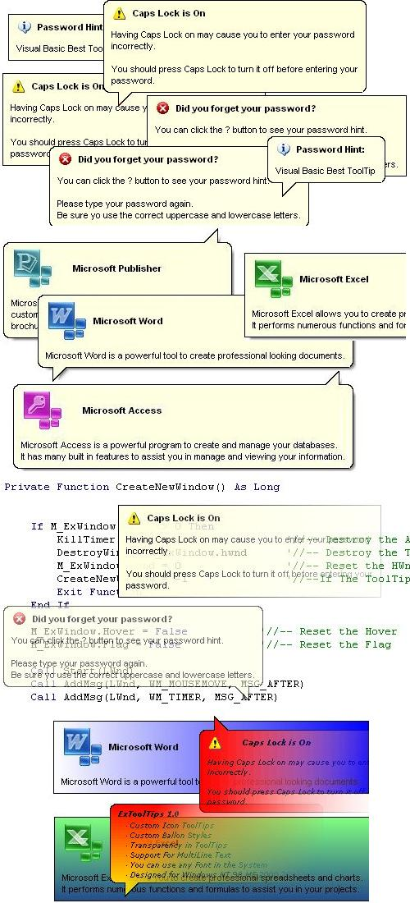



## VB ExTooltip

### Description

ExTooltip Class is the First Full VB Open Source from Scratch written code, that allows you to create AWESOME Customizable tooltips.

Display any custom Icon of Your Choice.

ToolTip can be standard rectangle, or Balloon style like windows 2000/XP

Make Your Balloon Tooltip Semi-Transparent (Works on All Windows)

Add Any Color, Gradient or Picture of your choice to the Background.

Use any Custom Font you want on each Tooltip. And more!!

The Ultimate Tooltip code you will want to use!

Updates at http://www.geocities.com/sistec_de_juarez/ExTooltip/
 
### More Info
 

             |
---                |---
**Submitted On**   |2005-04-03 15:25:30
**By**             |[MArio Flores G](https://github.com/Planet-Source-Code/PSCIndex/blob/master/ByAuthor/mario-flores-g.md)
**Level**          |Advanced
**User Rating**    |5.0 (489 globes from 98 users)
**Compatibility**  |VB 5\.0, VB 6\.0
**Category**       |[Custom Controls/ Forms/  Menus](https://github.com/Planet-Source-Code/PSCIndex/blob/master/ByCategory/custom-controls-forms-menus__1-4.md)
**World**          |[Visual Basic](https://github.com/Planet-Source-Code/PSCIndex/blob/master/ByWorld/visual-basic.md)
**Archive File**   |[VB\_ExToolt187167442005\.zip](https://github.com/Planet-Source-Code/mario-flores-g-vb-extooltip__1-59810/archive/master.zip)

